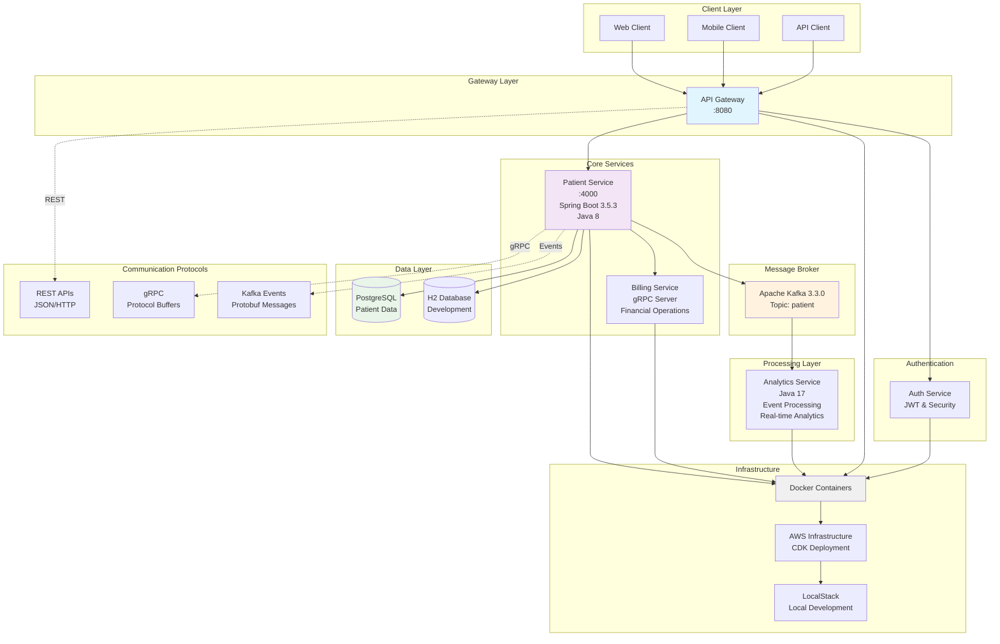
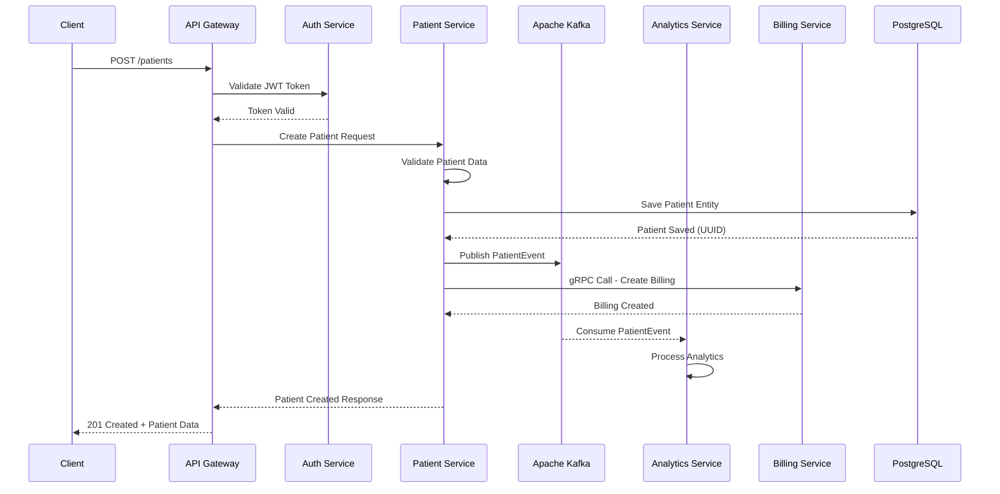
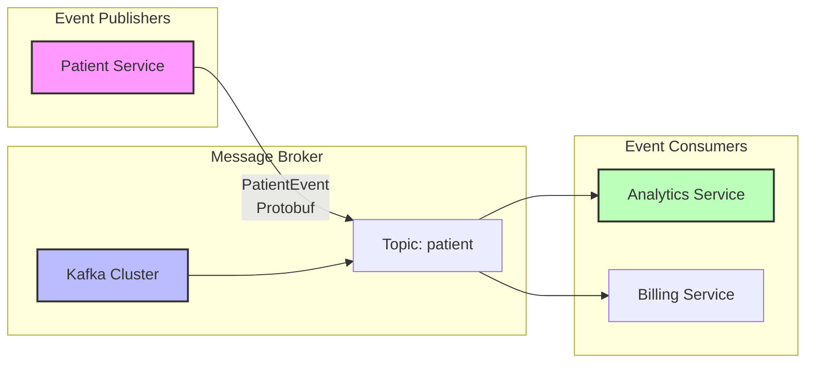
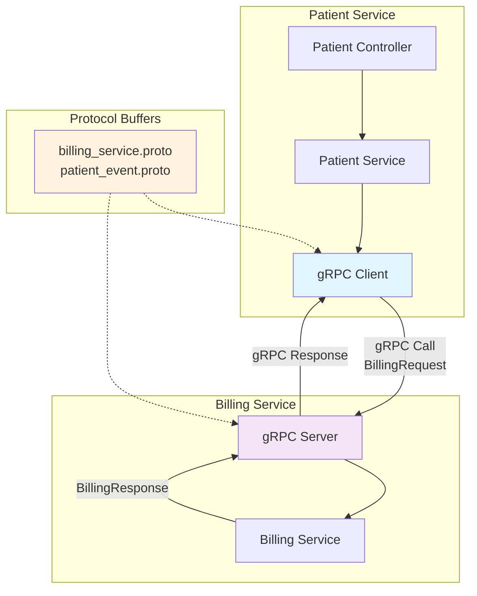

# Patient Management System

A comprehensive microservices-based patient management system built with Spring Boot, Apache Kafka, gRPC, and PostgreSQL. This system provides a scalable healthcare platform for managing patient data, authentication, billing, and analytics with event-driven architecture.

## 🏗️ Architecture Overview

The system follows a microservices architecture pattern with event-driven communication, gRPC inter-service calls, and comprehensive data management.

### System Architecture Diagram



### Simplified Service Flow

```
┌─────────────────┐    ┌──────────────────┐    ┌─────────────────┐
│   API Gateway   │────│  Patient Service │────│ Billing Service │
│      :8080      │    │      :4000       │    │   gRPC Server   │
└─────────────────┘    └──────────────────┘    └─────────────────┘
         │                        │                       │
         │                        │                       │
    ┌─────────┐              ┌─────────┐            ┌─────────┐
    │ Auth    │              │ Apache  │            │ Protocol│
    │ Service │              │ Kafka   │            │ Buffers │
    │   JWT   │              │ :9092   │            │Messages │
    └─────────┘              └─────────┘            └─────────┘
         │                        │                       │
         │                   ┌────┴────┐                  │
    ┌─────────────────────────────────────────────────────────┐
    │              Analytics Service                          │
    │           (Kafka Event Consumer)                        │
    │              Java 17 Runtime                            │
    └─────────────────────────────────────────────────────────┘
                              │
                    ┌─────────────────┐
                    │   PostgreSQL    │
                    │    Database     │
                    │  Patient Data   │
                    └─────────────────┘
```

### Data Flow Diagrams

#### Patient Creation Flow


#### Event-Driven Communication Pattern


#### gRPC Communication Flow


## 🚀 Services

### 1. Patient Service (Port: 4000)
**Main service for patient data management**
- **Technology**: Spring Boot 3.5.3, Java 8
- **Database**: PostgreSQL (H2 for development)
- **Features**:
  - CRUD operations for patient records
  - Email validation and uniqueness constraints
  - Kafka event publishing for patient creation
  - gRPC communication with billing service
  - RESTful API with OpenAPI documentation
  - JPA/Hibernate for database operations

### 2. Auth Service
**Authentication and authorization service**
- **Technology**: Spring Boot
- **Features**:
  - User authentication and authorization
  - JWT token management
  - Secure API endpoints

### 3. Billing Service
**Financial operations and billing management**
- **Technology**: Spring Boot
- **Features**:
  - gRPC server implementation
  - Billing calculations and invoicing
  - Integration with patient data

### 4. Analytics Service
**Real-time data processing and analytics**
- **Technology**: Spring Boot, Java 17
- **Features**:
  - Kafka consumer for patient events
  - Real-time data processing
  - Analytics and reporting capabilities
  - Event-driven architecture

### 5. API Gateway
**Central entry point for all client requests**
- **Technology**: Spring Boot
- **Features**:
  - Request routing and load balancing
  - Authentication integration
  - Rate limiting and monitoring

## 🛠️ Technology Stack

### Backend Technologies
- **Framework**: Spring Boot 3.5.3
- **Languages**: Java 8 & Java 17
- **Database**: PostgreSQL, H2 (development)
- **Message Broker**: Apache Kafka 3.3.0
- **Communication**: gRPC, REST APIs
- **Documentation**: OpenAPI/Swagger
- **Build Tool**: Maven
- **Containerization**: Docker

### Key Dependencies
- Spring Data JPA
- Spring Validation
- Spring Kafka
- gRPC (Java implementation)
- Protocol Buffers
- PostgreSQL Driver
- Springdoc OpenAPI

## 📋 Prerequisites

- **Java**: OpenJDK 8 & 17
- **Maven**: 3.6+
- **Docker**: 20.10+
- **PostgreSQL**: 13+
- **Apache Kafka**: 2.8+

## 🏃‍♂️ Quick Start

### 1. Clone the Repository
```bash
git clone <repository-url>
cd Patient-Management
```

### 2. Build All Services
```bash
# Build Patient Service
cd Patient-Service
mvn clean compile
cd ..

# Build Analytics Service
cd analytics-service
mvn clean compile
cd ..

# Build other services...
```

### 3. Infrastructure Setup
```bash
# Deploy infrastructure using LocalStack
cd infrastructure
./localstack-deploy.sh
```

### 4. Start Services

#### Patient Service
```bash
cd Patient-Service
mvn spring-boot:run
```
Service will be available at: `http://localhost:4000`

#### Analytics Service
```bash
cd analytics-service
mvn spring-boot:run
```

#### Other Services
Start each service in a separate terminal following the same pattern.

### 5. Using Docker
```bash
# Build Docker images for each service
docker build -t patient-service ./Patient-Service
docker build -t analytics-service ./analytics-service
# ... build other services

# Run with Docker Compose (if available)
docker-compose up -d
```

## 📚 API Documentation

### Patient Service Endpoints

#### Create Patient
```http
POST http://localhost:4000/patients
Content-Type: application/json

{
  "name": "John Doe",
  "email": "john.doe@example.com",
  "address": "123 Main Street",
  "dateOfBirth": "1990-01-15",
  "registeredDate": "2024-11-28"
}
```

#### Get All Patients
```http
GET http://localhost:4000/patients
```

#### Update Patient
```http
PUT http://localhost:4000/patients/{id}
Content-Type: application/json

{
  "name": "John Doe Updated",
  "email": "john.doe.updated@example.com",
  "address": "456 Oak Avenue",
  "dateOfBirth": "1990-01-15",
  "registeredDate": "2024-11-28"
}
```

#### Delete Patient
```http
DELETE http://localhost:4000/patients/{id}
```

### Swagger UI
Access interactive API documentation at: `http://localhost:4000/swagger-ui.html`

## 🔄 Event-Driven Architecture

### Kafka Topics
- **patient**: Patient lifecycle events (creation, updates)

### Event Flow
1. **Patient Created** → Kafka Event → Analytics Service
2. **Patient Updated** → Kafka Event → Analytics Service
3. **Billing Request** → gRPC Call → Billing Service

### Event Schema (Protocol Buffers)
```protobuf
message PatientEvent {
  string patient_id = 1;
  string name = 2;
  string email = 3;
  string event_type = 4;
}
```

## 🗄️ Database Schema

### Patient Entity
```sql
CREATE TABLE patient (
    id UUID PRIMARY KEY,
    name VARCHAR(255) NOT NULL,
    email VARCHAR(255) UNIQUE NOT NULL,
    address VARCHAR(255) NOT NULL,
    date_of_birth DATE NOT NULL,
    registered_date DATE NOT NULL
);
```

## 🧪 Testing

### API Testing
Use the provided HTTP files in the `api-requests/` directory:
- `patient-service/create-patient.http`
- `patient-service/get-patients.http`
- `patient-service/update-patient.http`
- `patient-service/delete-patient.http`

### Unit Testing
```bash
# Run tests for Patient Service
cd Patient-Service
mvn test

# Run tests for Analytics Service
cd analytics-service
mvn test
```

## 🚧 Development

### Project Structure
```
Patient-Management/
├── Patient-Service/          # Main patient management service
├── analytics-service/        # Event processing and analytics
├── api-gateway/             # API routing and authentication
├── auth-service/            # User authentication
├── billing-service/         # Billing and financial operations
├── infrastructure/          # AWS CDK infrastructure code
├── api-requests/           # HTTP test files
├── grpc-requests/          # gRPC test requests
└── integration-tests/      # End-to-end tests
```

### Configuration
- **Patient Service**: `Patient-Service/src/main/resources/application.properties`
- **Analytics Service**: `analytics-service/src/main/resources/application.properties`

### Adding New Features
1. Create new endpoints in respective service controllers
2. Add corresponding DTOs and validation
3. Update Kafka event schemas if needed
4. Add tests and documentation
5. Update API request files

## 🔧 Configuration

### Kafka Configuration
```properties
spring.kafka.producer.key-serializer=org.apache.kafka.common.serialization.StringSerializer
spring.kafka.producer.value-serializer=org.apache.kafka.common.serialization.ByteArraySerializer
```

### Database Configuration
```properties
# PostgreSQL (Production)
spring.datasource.url=jdbc:postgresql://localhost:5432/patientdb
spring.datasource.username=admin
spring.datasource.password=password

# H2 (Development)
spring.h2.console.path=/h2-console
spring.datasource.url=jdbc:h2:mem:testdb
```

## 📦 Deployment

### AWS Infrastructure
The project includes AWS CDK infrastructure code in the `infrastructure/` directory for cloud deployment.

### Local Development
Use LocalStack for local AWS services simulation:
```bash
cd infrastructure
./localstack-deploy.sh
```

## 🤝 Contributing

1. Fork the repository
2. Create a feature branch (`git checkout -b feature/amazing-feature`)
3. Commit your changes (`git commit -m 'Add some amazing feature'`)
4. Push to the branch (`git push origin feature/amazing-feature`)
5. Open a Pull Request

## 📄 License

This project is licensed under the MIT License - see the LICENSE file for details.

## 🆘 Troubleshooting

### Common Issues

1. **Port Conflicts**: Ensure ports 4000, 5432, 9092 are available
2. **Kafka Connection**: Verify Kafka broker is running on localhost:9092
3. **Database Issues**: Check PostgreSQL/H2 connectivity
4. **gRPC Errors**: Ensure all services are properly started

### Logs and Debugging
```bash
# Enable debug logging
logging.level.root=debug
logging.level.com.pm=debug
```

## 📞 Support

For support and questions:
- Create an issue in the repository
- Check the existing documentation
- Review the API request examples in `api-requests/`

---

**Built with ❤️ using Spring Boot, Kafka, and gRPC**
